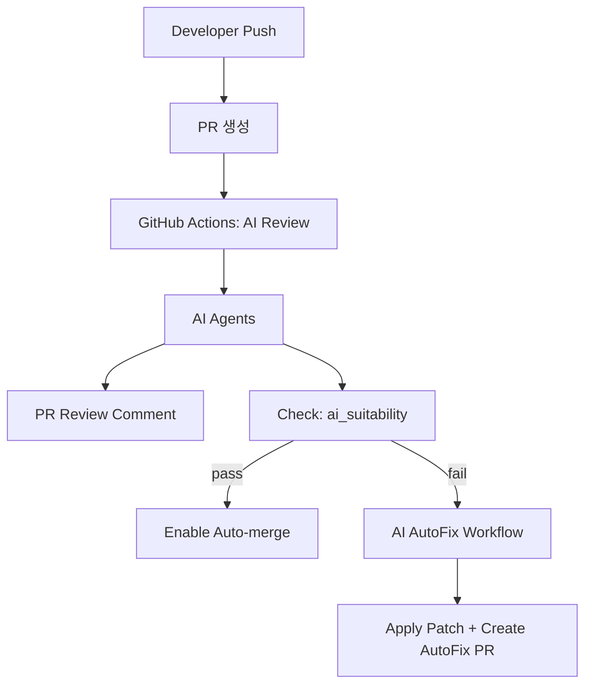

# AutoReview-AI

PR 생성부터 AI 리뷰, 자동 수정, rebase 자동 머지까지 이어지는 **AI 기반 코드 리뷰/PR 평가 자동화 시스템**입니다. GitHub Actions와 멀티 에이전트를 활용해 리뷰 품질과 일관성을 높이고, 위험도가 높은 변경은 자동으로 차단/수정하도록 설계되었습니다.

## 아키텍처 흐름도



## 핵심 흐름
1. 사용자가 PR 생성
2. GitHub Actions가 AI 리뷰 실행 → PR 코멘트 + `ai_suitability` 체크 생성
3. 통과 시 rebase auto-merge 활성화
4. 실패 시 AutoFix가 자동 수정 브랜치/PR 생성

## 주요 기능
- 멀티 에이전트 리뷰(Style/BugRisk/Performance/Security/Summary)
- 에이전트별 프롬프트/스키마/체크리스트 기반 리뷰
- OpenAI API 연동(리뷰/자동수정)
- AutoFix 안전장치(패치 크기/확장자 제한, 재시도 정책)
- 정책 기반 머지/차단 관리(`config/review-policy.yaml`)

## 빠른 실행(로컬)

```powershell
.\.venv\Scripts\Activate.ps1
uvicorn app.main:app --reload
```

헬스 체크:
```
GET http://127.0.0.1:8000/health
```

## 필수 설정(Repository Secrets)
- `OPENAI_API_KEY`
- `AI_GITHUB_TOKEN` (GitHub App 토큰)

선택:
- `OPENAI_ORG`
- `OPENAI_PROJECT`

## 브랜치 보호 및 Auto-merge 설정(권장)
자동 설정 스크립트 사용:
```powershell
# gh auth login 필요
.\scripts\configure_github.ps1 -Owner "ORG" -Repo "REPO" -Branch "main"
```

## 문서 안내
- `dev-plan.md`: 개발 계획서 초안
- `docs/user-install.md`: 사용자 설치/설정 가이드(자동설정 스크립트 포함)
- `docs/github-setup.md`: GitHub App/브랜치 보호 설정
- `docs/current-status.md`: 현재 구현 상태
- `docs/agent-spec.md`: 에이전트 출력 스키마
- `docs/work-summary.md`: 최근 작업 요약

## 구성 파일
- `config/review-policy.yaml`: 머지/차단 정책
- `config/agent-prompts.yaml`: 에이전트 프롬프트/체크리스트
- `config/rules/*.yaml`: 언어/프레임워크 규칙 템플릿

## 개발/운영 FAQ

**Q. 리뷰/코멘트가 PR에 안 보입니다.**
- `AI_GITHUB_TOKEN` 권한 확인(Pull requests/Checks/Contents/Issues)
- GitHub App이 해당 저장소에 설치되어 있는지 확인

**Q. `ai_suitability` 체크가 생성되지 않습니다.**
- Actions 실행 여부 확인
- `OPENAI_API_KEY`가 설정되어 있는지 확인

**Q. AutoFix PR이 생성되지 않습니다.**
- Auto-merge 활성화 여부 확인
- 브랜치 보호 규칙에 `ai_suitability` 필수 체크가 설정되어 있는지 확인

**Q. 비용을 줄이려면 어떻게 하나요?**
- `config/review-policy.yaml`에서 모델/토큰 제한을 낮추고, 룰 템플릿을 강화해 AI 호출량을 줄입니다.
